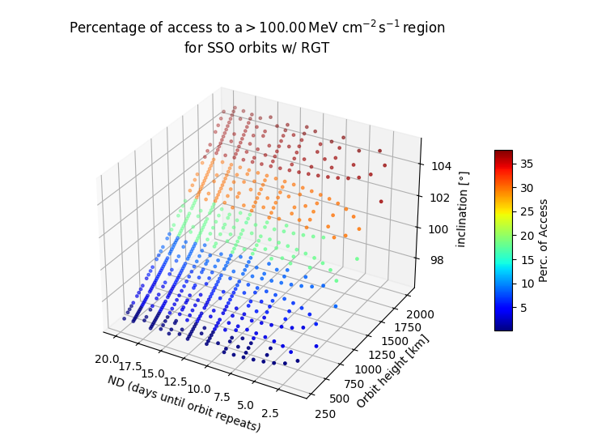

## SSO w/ RGT

Satellites in Sun-Synchronous Orbits (SSOs) provide consistent illumination conditions throughout the year by crossing specific latitude bands at the same mean local time (MLT), ideal for visible and infrared observations. When combined with Repeat Ground Tracks (RGTs), these orbits allow precise revisits of stationary ground targets at predetermined times, making them optimal for missions like Landsat, Sentinel, and SAOCOM. However, such satellites are prone to Single Event Upsets (SEUs) when traversing high-radiation regions. The percentage of time spent in these zones significantly impacts their Total Ionizing Dose (TID) over their operational lifespan

## Why do we see such a discrete change in colors here?

This is due to the fact that polygon "shells" are generated at 300km distance height, except for commonly used LEOs where 750, 800 and 850 and 900 km models where generated. Given the orbit's height the closest model is chosen and used. As a future work we can generate as many models as we want, such that granularity will increase and thus, we'll have a "smoother" rainbow.

